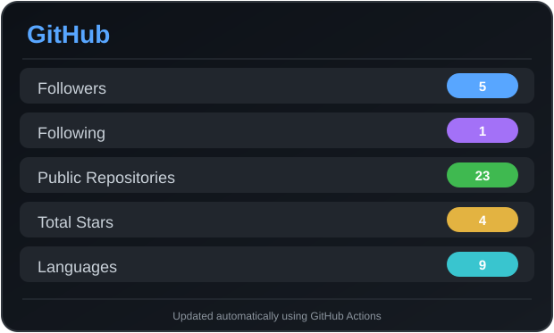
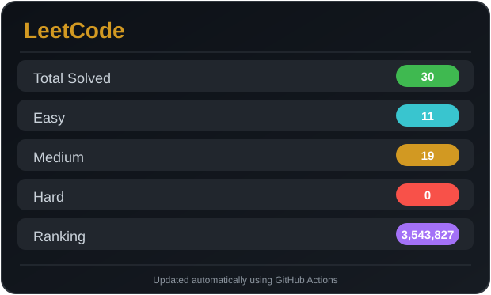
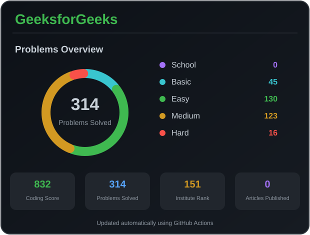

<h1 align="center">Hi 👋, I'm Brilliant Ambuj</h1>

<h3 align="center">
Software Engineer • C++ Developer • AI & Machine Learning Enthusiast • CAD/CAM Developer
</h3>

---

# 📊 Coding Profiles

# 🌐 Connect

---

# 🚀 Tech Stack

---

# 🔥 GitHub Streak

---

# 📈 Contribution Graph

---

# 💻 LeetCode Card

---

# 🐍 Contribution Snake

---

# 🚀 Featured Projects

# 📈 Top Languages

- **Jupyter Notebook** — 5851874 bytes

- **JavaScript** — 3306417 bytes

- **HTML** — 1342468 bytes

- **CSS** — 351292 bytes

- **Python** — 84467 bytes

- **C++** — 29417 bytes

- **C** — 7554 bytes

- **TypeScript** — 374 bytes

- **Shell** — 352 bytes

---

# ⭐ Top Repositories

### khata_book

⭐ Stars: 2

🍴 Forks: 0

🔗 https://github.com/ambuj1211/khata_book

---

### ambuj-profile-card

⭐ Stars: 1

🍴 Forks: 0

🔗 https://github.com/ambuj1211/ambuj-profile-card

---

### code-compiler

⭐ Stars: 1

🍴 Forks: 0

🔗 https://github.com/ambuj1211/code-compiler

---

### AlphaPrompt

⭐ Stars: 0

🍴 Forks: 1

🔗 https://github.com/ambuj1211/AlphaPrompt

---

### ambuj1211

⭐ Stars: 0

🍴 Forks: 0

🔗 https://github.com/ambuj1211/ambuj1211

---

# 🎯 Goals

- 🚀 Build impactful Open Source software
- 💻 Master Modern C++
- 🤖 AI Powered CAD Systems
- 🌍 Learn Cloud Computing
- 📚 Grow Educational Mania

---

# 💬 Quote

> "First, solve the problem. Then, write the code."

---

### Thanks for visiting ❤️

